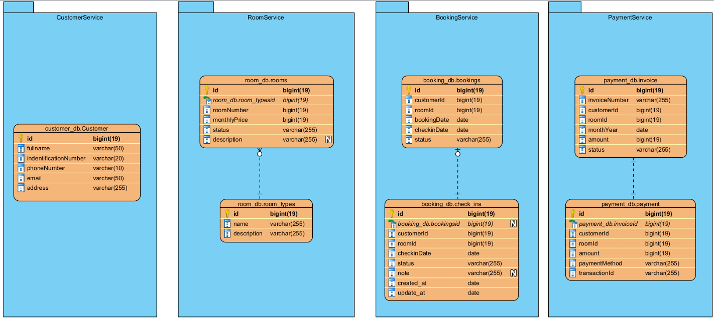
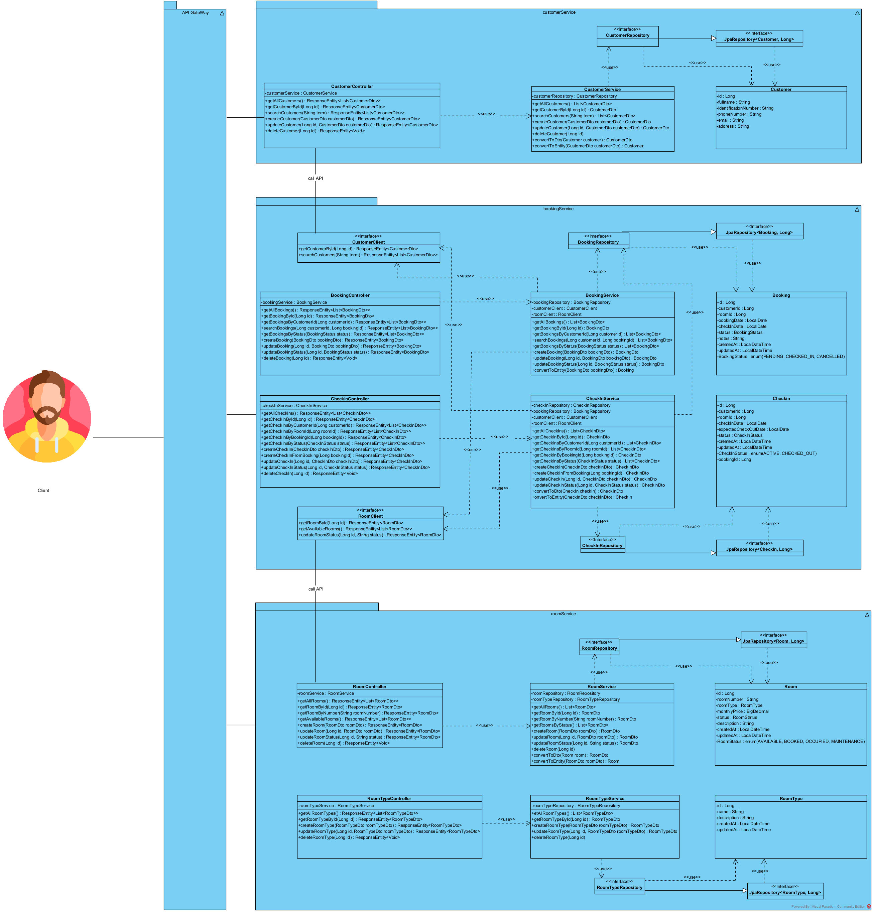
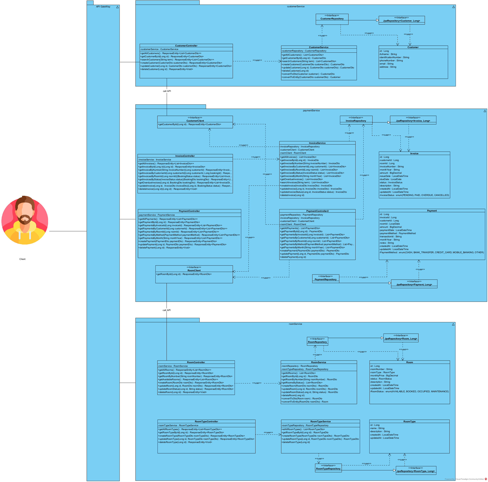

# 📊 Microservices System - Analysis and Design

This document outlines the **analysis** and **design** process for your microservices-based system assignment. Use it to explain your thinking and architecture decisions.

---

## 1. 🎯 Problem Statement

_Describe the problem your system is solving._

- Who are the users?
- What are the main goals?
- What kind of data is processed?

> Example: A course management system that allows students to register for courses and teachers to manage class rosters.

---

## 2. 🧩 Identified Microservices

List the microservices in your system and their responsibilities.

| Service Name  | Responsibility                                | Tech Stack   |
|---------------|------------------------------------------------|--------------|
| service-a     | Handles user authentication and authorization | Python Flask |
| service-b     | Manages course registration and class data    | Python Flask |
| gateway       | Routes requests to services                   | Nginx / Flask|

---

## 3. 🔄 Service Communication

Describe how your services communicate (e.g., REST APIs, message queue, gRPC).

- Gateway ⇄ service-a (REST)
- Gateway ⇄ service-b (REST)
- Internal: service-a ⇄ service-b (optional)

---

## 4. 🗂️ Data Design
Hệ thống được thiết kế dựa trên kiến trúc Microservices, trong đó mỗi dịch vụ đảm nhận một chức năng riêng biệt, có cơ sở dữ liệu độc lập và giao tiếp với nhau thông qua API. Với 4 service chính để cung cấp đầy đủ chức năng cho quy trình thuê và quản lý phòng:

**1. CustomerService**
- Là đối tượng trung tâm kết nối với Booking và Payment 
- Quản lý toàn bộ thông tin khách hàng trong hệ thống
- Cung cấp dữ liệu khách hàng cho các service khác thông qua API 

**2. RoomService**
- Quản lý danh mục phòng và loại phòng 
- Theo dõi trạng thái phòng (trống, đã đặt, đang sử dụng, bảo trì)
- Cung cấp thông tin phòng cho BookingService và PaymentService 

**4. BookingService**
- Quản lý quá trình đặt phòng và nhận phòng
- Theo dõi lịch sử đặt phòng và nhận phòng của khách hàng 
- Cung cấp dữ liệu cho việc lập hóa đơn và thanh toán

**5. PaymentService**
- Quản lý hóa đơn và thanh toán
- Theo dõi lịch sử thanh toán của khách hàng 
- Cung cấp dữ liệu cho báo cáo tài chính

***Microservices ERD**

---

## 5. 🔐 Security Considerations
**Validate input on each service**
- Giúp cho việc đảm bảo dữ liệu được nhập vào từ giao diện người dùng là hợp lệ, an toàn và đầy đủ
- Trước khi xử lý dữ liệu, mỗi API sẽ kiểm tra các trường bắt buộc (required), định dạng (format, regex), độ dài, kiểu dữ liệu,...
**Use JWT for user sessions**
- ...
**Role-based access control for APIs**
- ...

---

## 6. 📦 Deployment Plan
Sử dụng docker để đóng gói và triển khai các service trong kiến trúc microservice. Mỗi service sẽ có 1 Dockerfile riêng biệt. Bên cạnh đó sử dụng .env để quản lý cấu hình như port(cổng), thông tin database, ...
<!-- - Use `docker-compose` to manage local environment
- Each service has its own Dockerfile
- Environment config stored in `.env` file -->

---

## 7. 🎨 Architecture Diagram
**Khách hàng nhận phòng**

**Nhận thanh toán hàng tháng từ khách hàng**

## ✅ Summary

- Kiến trúc microservices được áp dụng trong hệ thống quản lý thuê phòng mang lại nhiều lợi ích thiết thực và phù hợp với yêu cầu nghiệp vụ.
- Hệ thống được chia thành 4 service chính: CustomerService, RoomService, BookingService, và PaymentService, mỗi service chịu trách nhiệm xử lý một nghiệp vụ cụ thể.
- Mỗi service có thể được triển khai và mở rộng độc lập. Được đóng gói bằng Docker và triển khai riêng biệt, giúp giảm rủi ro và đơn giản hóa quá trình triển khai

## Author

- Nguyễn Văn Hòa - B21DCCN380
- Nghiêm Xuân Quân - B21DCCN608
